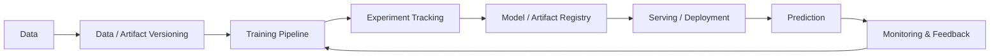

# End-to-End MLOps — MLflow, DVC & Model Serving

An earlier **MLOps engineering portfolio project** exploring the lifecycle around model experimentation, artifact/data versioning, prediction, model switching, and deployment patterns.

> Portfolio context: this project represents part of my progression from ML/MLOps engineering toward my current focus as a **Lead Data & AI Architect**, designing enterprise Data + AI platforms, GenAI/RAG systems, agentic workflows, governance, observability, and production controls.

## What this repository explores

A model is only useful in production when the surrounding engineering system can reproduce, version, deploy, observe, and safely change it. This repository brings several of those lifecycle concerns together.

## Repository evidence

The project includes assets for:

- `main.py` — primary workflow/application logic
- `prediction.py` — prediction workflow
- `switch_models.py` — model switching/lifecycle experimentation
- `deploy_aws_sagemaker.py` — AWS SageMaker deployment exploration
- `config.yaml` — externalized configuration
- `requirements.txt` — Python dependencies
- `mlruns/` — MLflow experiment artifacts
- `artifact/` — generated/project artifacts
- `data/` — data assets
- `utils/` — reusable utilities

## MLOps architecture concerns

| Concern | Engineering purpose |
| --- | --- |
| Experiment tracking | Compare model runs and retain reproducibility evidence |
| Data/artifact versioning | Connect training inputs to model outputs |
| Configuration | Separate runtime parameters from implementation code |
| Model lifecycle | Make model selection and switching explicit |
| Deployment | Move trained models toward managed serving environments |
| Prediction | Provide a repeatable inference path |
| Reproducibility | Reconstruct an experiment from code, data, config, and dependencies |

## Production evolution

For a modern enterprise implementation, I would extend this pattern with:

- CI/CD and automated quality gates
- Model registry promotion policies
- Infrastructure as code
- Secrets and workload identity
- Feature/data validation
- Drift and model-performance monitoring
- Distributed tracing and centralized observability
- Security scanning and supply-chain controls
- Approval policies for production promotion
- Cost/SLO monitoring

For **GenAI and Agentic AI**, the equivalent lifecycle also needs prompt/model/tool versioning, retrieval evaluation, agent traces, safety evaluation, human approval, memory/state governance, and auditable tool execution.

## Technology themes

**Python · MLflow · DVC · MLOps · Model Serving · AWS SageMaker · Configuration Management · Experiment Tracking · Model Lifecycle · Cloud AI**

## Why it matters to Data + AI Architecture

MLOps provides many of the operational foundations required by enterprise AI architecture: reproducibility, controlled promotion, observability, versioning, automation, and measurable outcomes. Those principles carry directly into LLMOps and agentic platforms.

---

### Keywords

`MLOps` · `MLflow` · `DVC` · `Machine Learning` · `Model Deployment` · `AWS SageMaker` · `Experiment Tracking` · `Model Registry` · `AI Platform` · `LLMOps` · `AI Architecture` · `Cloud Architecture`